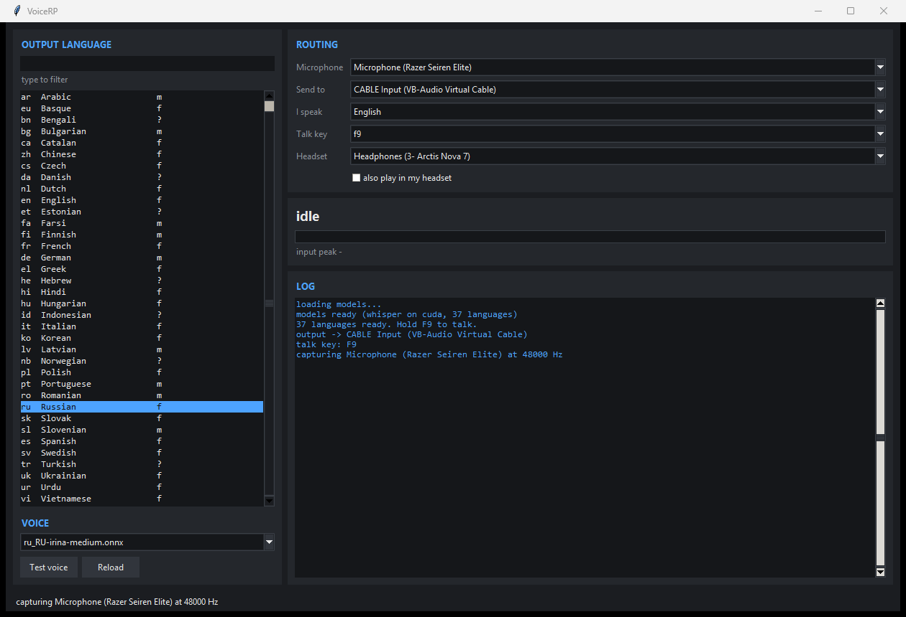

# VoiceRP

Local, offline voice changer and push-to-talk speech translation for milsim
roleplay. Built for **ARMA OVER ALL** (Arma Reforger VON), but the output is the
Windows default microphone, so it works in Discord, Teams, OBS or a browser too.

Two independent tools sharing one virtual audio cable:

| | What it does | Latency |
|---|---|---|
| **Voice changer** | Your words, a different person's voice (real-time RVC) | ~190 ms |
| **Translate bridge** | You speak English or Polish, they hear one of 37 languages | ~650 ms - 1.0 s |

Everything runs on your own machine. No API keys, no per-hour cost, no audio
leaves the PC.

The translate bridge has a GUI (`translate/gui.py`) and a keyboard-only CLI
(`translate/bridge.py`). Both drive the same engine, `translate/voicerp_core.py`.

## The GUI



```powershell
voice-changer\voicerp-gui.bat          # no console
voice-changer\voicerp-gui-debug.bat    # keeps a console for tracebacks
```

- **Output language** - all 37, filter box, `m`/`f` per voice. Languages with
  more than one Piper voice get a picker underneath; the choice is remembered.
- **Routing** - microphone, the cable to send to, source language, talk key,
  and an optional second sink so you hear what was sent. Devices are resolved
  by **name**, because PortAudio indices move when USB audio is replugged.
- **Test voice** synthesises a line straight to the output, so routing can be
  proven without talking.
- Selections persist in `translate/gui_state.json`.

Models load on a worker thread; the mic stream is opened from the Tk main
thread, which WASAPI requires (see GOTCHAS #15).

The arrangement follows Beatrice's layout. **No Beatrice code is used**: its
`LICENSE.txt` is MIT but `LICENSES_BUNDLED.txt` states the program contains a
non-public inference library that needs individual permission from Project
Beatrice. Only the idea of the layout is borrowed.

## What the CLI looks like

```
* rec
* processing
  input peak -14.3 dB
    seg [0.0s-3.0s] nsp=0.32 logp=-0.45 :: One, two, three, four, five.
  EN : One, two, three, four, five.
  RU : Raz, dva, tri, chetyre, pyat.
  stt 101ms  mt 74ms  tts 473ms  TOTAL 648ms  (4.2s of audio)
```

## The chain

```
                     +- voice changer -------------+
  microphone ------->| VCClient (RVC, CUDA)        |--+
                     +-----------------------------+  |
                     +- translate bridge ----------+  +--> CABLE Input
  microphone ------->| faster-whisper (CUDA)       |  |         |
        (F9 held)    |   -> Argos Translate        |--+   (same cable)
                     |   -> Piper TTS              |            v
                     +-----------------------------+      CABLE Output
                                                      = Windows default mic
                                                            |
                        Arma Reforger . Discord . Teams . OBS
```

Neither tool is selected as the microphone in the game or in Discord. They grab
the real mic themselves and write into the cable; the cable is what apps hear.

## Languages

37 languages have **both** an Argos translation pack and a working Piper voice.
Either alone is useless, so the bridge checks at startup rather than failing
mid-sentence.

**European** - Albanian, Basque, Bulgarian, Catalan, Czech, Danish, Dutch,
English, Estonian, Finnish, French, German, Greek, Hungarian, Italian, Latvian,
Norwegian, Polish, Portuguese, Romanian, Russian, Slovak, Slovenian, Spanish,
Swedish, Ukrainian

**Asian / Middle East** - Arabic, Bengali, Chinese, Farsi, Hebrew, Hindi,
Indonesian, Korean, Turkish, Urdu, Vietnamese

**Not possible** - Japanese (Piper has no OpenJTalk phonemiser) and Thai (no
word segmenter). Translation packs exist for both; the speech synthesis does
not. Recorded in `translate/langs_broken.json` with the reason.

Source languages: English and Polish both ways, so Polish in -> Russian out
works by pivoting through English. Auto-detect exists but is slower and less
reliable on one-word callouts.

Where Piper has no female voice for a language (German, Portuguese, Romanian,
Bulgarian, Latvian, Slovenian, Albanian, Arabic, Farsi) the entry is male. That
is a catalogue limit, not a setting. `F11` prints the gender of each voice.

## Hardware this was built and measured on

- RTX 4080, i9-13900KF, 64 GB - whisper on the GPU at ~140-250 ms
- Razer Seiren Elite (USB condenser) and SteelSeries Arctis Nova 7
- VB-Audio Virtual Cable, Windows 11

A weaker GPU is fine; whisper falls back to CPU int8 automatically (~1.2 s
instead of ~200 ms). No GPU works but roughly doubles the translate delay.

## Install

See **[AGENT.md](AGENT.md)** - written so an AI coding agent with shell access
can do the whole setup, including the parts that are easy to get wrong. A human
can follow the same file.

```powershell
# 1. VB-Audio Virtual Cable        https://vb-audio.com/Cable/
# 2. python -m venv venv ; venv\Scripts\pip install -r requirements.txt
# 3. python translate\getvoices.py       # ~2.5 GB of Piper voices
# 4. python translate\getargos.py        # 37 Argos translation packs
# 5. python translate\validate_langs.py  # confirm every language speaks
# 6. python translate\gui.py        # or bridge.py for the keyboard-only CLI
```

## Keys (CLI, and F9 in the GUI)

| Key | |
|---|---|
| **F9** | hold to talk |
| **F3** | next target language (cycles all 37) |
| **F1** | source language: English -> Polish -> auto |
| F5 / F4 / F6 / F7 / F8 / F2 | Russian / Ukrainian / Spanish / French / Polish / English |
| F11 | list every language + current state |
| F12 | quit |

## Read this before debugging audio

**[docs/GOTCHAS.txt](docs/GOTCHAS.txt)** is the most valuable file here - 23
numbered findings, each with the measurement that proved it. The expensive ones:

- **Piper must never write to stdout.** Windows text mode expands every `0x0A`
  to `0x0D 0x0A`, misaligning every sample after it - 8621 int16 jumps > 32768
  in 4.5 s, about 1800 full-scale clicks per second.
- **Level metrics cannot see crackle.** `volumedetect`, mean/max volume and flat
  factor all called that corrupted audio clean, because the level *was* fine.
  Count sample-to-sample slope instead; `tools/` does it.
- **Windows 11 "Voice Clarity"** binds an audio effect to microphone capture and
  can gate a studio mic to digital zero. It sits in the audio engine, so every
  API sees the damage.
- **WASAPI streams must be opened on the main thread**, or you get
  `PaErrorCode -9999` blaming the wrong backend.
- **Swap the microphone first.** Two different mics failing identically means
  the bug is in the code. That test ended an hour of chasing hardware.

## Layout

```
translate/      voicerp_core.py (engine), gui.py, bridge.py (CLI),
                langs.json, the three setup scripts
voice-changer/  VCClient launcher and live voice switching (PowerShell)
tools/          audio diagnostics - meter, tone, cable glitch test, clip counter
docs/           GOTCHAS.txt, gui.png
```

## Licence and credits

This repo is MIT. It is glue around other people's work, used as published:

| | Licence |
|---|---|
| [faster-whisper](https://github.com/SYSTRAN/faster-whisper) | MIT |
| [Argos Translate](https://github.com/argosopentech/argos-translate) | MIT |
| [Piper](https://github.com/OHF-Voice/piper1-gpl) + [voices](https://huggingface.co/rhasspy/piper-voices) | MIT / per-voice |
| [VCClient](https://github.com/w-okada/voice-changer) | MIT (models vary) |
| VB-Audio Virtual Cable | donationware, not redistributed here |

No models or binaries are committed; the setup scripts fetch them from source.

**RVC voice models**: the five shipped with VCClient are Japanese voice-bank
characters with permissive terms. Do not use a model cloned from a real person's
voice without their consent.
